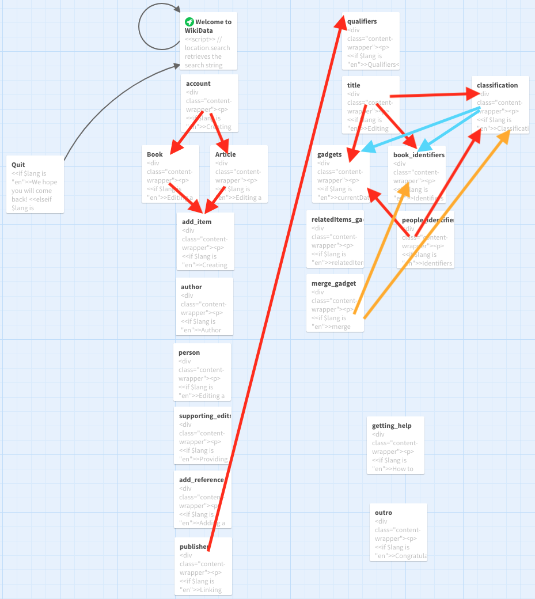

# twine-for-wikicite
An interactive story to welcome new users to WikiCite

[Grant proposal](https://meta.wikimedia.org/wiki/Wikicite/grant/WikiCite_for_Librarians:_Interactive_Learning_Pathways_for_Information_Professionals)

[Twine in English](https://heardlibrary.github.io/twine-for-wikicite/?en)

[Twine en español](https://heardlibrary.github.io/twine-for-wikicite/?es)

[Twine en français](https://heardlibrary.github.io/twine-for-wikicite/?fr)

[Twine用中文](https://heardlibrary.github.io/twine-for-wikicite/?zh-Hans)

[Twine language not specified](https://heardlibrary.github.io/twine-for-wikicite/)

[Style test (English)](https://heardlibrary.github.io/twine-for-wikicite/index_style_test.html?en) click on first link to get to styled page

[Style test (Spanish)](https://heardlibrary.github.io/twine-for-wikicite/index_style_test.html?es) click on first link to get to styled page

[Style test (Chinese)](https://heardlibrary.github.io/twine-for-wikicite/index_style_test.html?zh-Hans) click on first link to get to styled page

[Style test (French)](https://heardlibrary.github.io/twine-for-wikicite/index_style_test.html?fr) click on first link to get to styled page

Link to viewing MaryMae's first page as a web page <https://heardlibrary.github.io/twine-for-wikicite/WikiData2.html>

MaryMae's more complex page as a web page <https://heardlibrary.github.io/twine-for-wikicite/test-01-25.html>

Test of embedding Commons image and videos <https://heardlibrary.github.io/twine-for-wikicite/commons_test.html>

Workflow timeline
1. Video scripts due on Wednesday afternoon
2. Review scripts at Thursday meeting
3. Complete edited scripts by Friday
4. Translations finished by Monday
5. Loom videos by Tuesday
6. Character animation by Thursday morning
7. Video production by Thursday afternoon
8. Add to website by Friday
